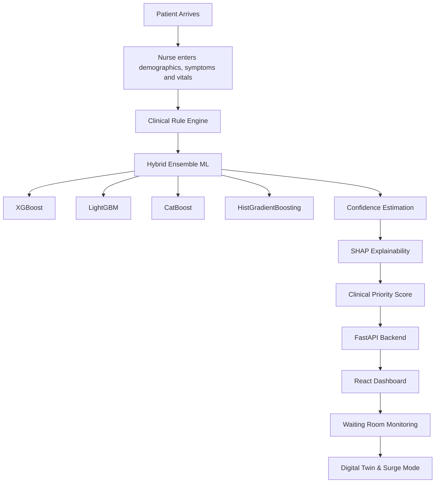
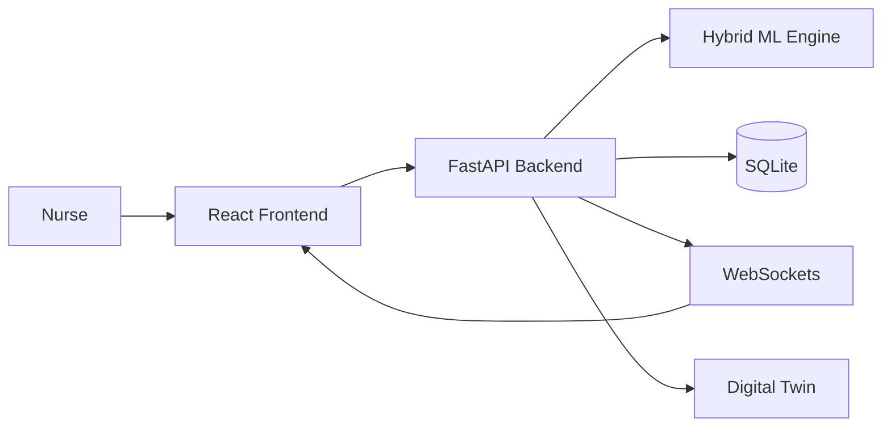

# PatientTriage.ai

### AI-Powered Clinical Decision Support System for Emergency Department Triage

> **The AI recommends. The nurse decides.**

PatientTriage.ai is an AI-assisted Clinical Decision Support System (CDSS) designed to help emergency department staff prioritize patients faster, safer, and more transparently. Every recommendation is explainable, reviewable, overridable, and permanently audit logged—ensuring that licensed clinicians always remain in control of patient care.


---
##  Project Documentation

Access the complete project presentation and solution walkthrough below.

> **Presentation (PDF):**  
> https://drive.google.com/file/d/1Lz4M7OuBMKZoW6hPbm4r2QS1pMXHa-zm/view?usp=share_link

## Overview

Emergency Departments often operate under severe time pressure, incomplete patient information, and unpredictable patient surges. Traditional triage relies heavily on clinician experience, making consistency difficult during high workload periods.

PatientTriage.ai augments—not replaces—clinical judgment by combining a **clinical rule engine** with a **hybrid machine learning ensemble** to provide:

- Real-time triage recommendations
- Confidence estimation
- Explainable AI (SHAP)
- Continuous waiting-room monitoring
- Dynamic Clinical Priority Score (CPS)
- Clinician override with full audit history

The system is designed around one core philosophy:

> **The AI recommends. The clinician decides.**

---

# Dataset

PatientTriage.ai is trained using the **MIMIC-IV-ED Demo Dataset**, released by the **MIT Laboratory for Computational Physiology** through **PhysioNet**.

Unlike synthetic datasets, MIMIC-IV-ED contains real emergency department encounters that have been carefully de-identified for research, making the system clinically grounded while preserving patient privacy.

## Dataset Components

| File | Purpose |
|------|---------|
| `edstays.csv.gz` | Emergency department visit records |
| `triage.csv.gz` | Initial nurse triage assessment |
| `vitalsign.csv.gz` | Heart rate, blood pressure, respiratory rate, temperature and SpO₂ |
| `diagnosis.csv.gz` | Emergency department diagnoses |
| `medrecon.csv.gz` | Medication reconciliation history |
| `pyxis.csv.gz` | Medication dispensing records |

## Data Engineering Pipeline

Before model training, the raw MIMIC-IV-ED data undergoes a complete preprocessing workflow.

1. Load and validate all datasets.
2. Merge patient stay and triage records.
3. Engineer clinically meaningful features.
4. Handle missing values safely.
5. Normalize numerical variables.
6. Train the hybrid ensemble model.
7. Generate SHAP explanations and evaluation reports.

## Engineered Clinical Features

Instead of relying only on raw vital signs, PatientTriage.ai derives clinically meaningful features including:

- Age Group (Infant, Child, Adolescent, Adult, Geriatric)
- Shock Index
- Mean Arterial Pressure (MAP)
- Pulse Pressure
- Abnormal Vitals Count
- Missing History Flag
- Arrival Hour
- Night Shift Flag
- Weekend Flag

These engineered features help the model capture physiological patterns that clinicians already use during emergency assessment.

---

# End-to-End Workflow



## Workflow Summary

1. **Patient Intake** – Demographics, symptoms and vital signs are entered.
2. **Clinical Rule Engine** – Critical red-flag conditions establish a minimum urgency level.
3. **Hybrid ML Ensemble** – Multiple boosting models generate a calibrated risk estimate.
4. **Confidence Estimation** – The uncertainty engine evaluates prediction reliability.
5. **SHAP Explainability** – Every recommendation includes its strongest contributing factors.
6. **Clinical Priority Score (CPS)** – AI risk is combined with waiting time, age vulnerability and uncertainty.
7. **Live Queue** – Recommendations appear instantly on the dashboard.
8. **Continuous Monitoring** – Waiting patients are reassessed whenever vitals worsen or safe waiting thresholds are exceeded.

---

# Clinical Safety Principles

PatientTriage.ai is intentionally designed around safety-first clinical principles.

- **Under-triage is worse than over-triage.**
- Missing data increases uncertainty—not confidence.
- Pediatric, adult and geriatric patients use separate physiological thresholds.
- The rule engine always executes before machine learning.
- Critical patients can never be silently downgraded by the ML model.
- Every recommendation is permanently audit logged.
- Every recommendation can be overridden by a licensed clinician.

---

# Feature Highlights

| Capability | Purpose |
|------------|---------|
| Hybrid AI Engine | Combines clinical rules with ensemble ML |
| Age-Aware Triage | Separate thresholds across age groups |
| Clinical Priority Score | Dynamic operational prioritization |
| Live Queue | Real-time WebSocket updates |
| SHAP Explainability | Transparent AI reasoning |
| Waiting Room Monitoring | Deterioration alerts |
| Sepsis Screening | qSOFA & SIRS evaluation |
| Protocol Detection | STEMI, Stroke and Sepsis triggers |
| Nurse Override | Human-in-the-loop decision making |
| Digital Twin | Emergency Department surge simulation |

---

# Backend Features

| Feature | Description |
|---------|-------------|
| FastAPI Backend | High-performance REST API |
| SQLAlchemy ORM | Database abstraction |
| Alembic | Version-controlled migrations |
| SQLite | Development database |
| WebSockets | Real-time queue updates |
| Hybrid Ensemble | XGBoost, LightGBM, CatBoost, HistGradientBoosting |
| SHAP | Explainable AI |
| Confidence Engine | Multi-signal uncertainty estimation |
| Audit Logging | Permanent recommendation history |
| Waiting Monitor | Automatic reassessment alerts |

---

# Frontend Features

| Page | Description |
|------|-------------|
| Emergency Command Center | Live hospital overview |
| Patient Intake | Real-time AI recommendation |
| Live Queue | Dynamic queue with CPS |
| Patient Comparison | Side-by-side comparison |
| AI Insights | SHAP explanations |
| Audit Logs | Override history |
| Digital Twin | Operational simulation |

---

# System Architecture



---

# Project Structure

```text
PatientTriageAI/
├── backend/
│   ├── app/
│   ├── ml/
│   ├── alembic/
│   ├── tests/
│   ├── data/
│   └── reports/
│
├── frontend/
│   ├── src/
│   ├── components/
│   ├── pages/
│   └── services/
│
├── docker-compose.yml
└── README.md
```

---

# Technology Stack

| Layer | Technologies |
|--------|--------------|
| Backend | FastAPI, SQLAlchemy, Alembic, SQLite, WebSockets |
| Machine Learning | XGBoost, LightGBM, CatBoost, HistGradientBoosting, SHAP, Optuna, MLflow |
| Frontend | React 18, Vite, TailwindCSS, Recharts, Framer Motion |
| Deployment | Docker, Docker Compose |
| Dataset | MIMIC-IV-ED |

---

# Running Locally

## Backend

```bash
cd backend

python3 -m venv venv

source venv/bin/activate

pip install -r requirements.txt

cp .env.example .env

python -m alembic upgrade head

python -m ml.train

uvicorn app.main:app --reload
```

## Frontend

```bash
cd frontend

npm install

npm run dev
```

### Local URLs

| Service | URL |
|----------|-----|
| Backend | `http://localhost:8000` |
| Swagger | `http://localhost:8000/docs` |
| Frontend | `http://localhost:5173` |

---

# Machine Learning Pipeline

Every patient assessment follows the same prediction pipeline.

```text
Patient Input

↓

Clinical Rule Engine

↓

Feature Engineering

↓

Ensemble Prediction

↓

Confidence Estimation

↓

SHAP Explanation

↓

Clinical Priority Score

↓

Live Queue Update
```

## Priority Levels

| Priority | Meaning |
|----------|---------|
| P1 | Immediate |
| P2 | Emergent |
| P3 | Urgent |
| P4 | Less Urgent |
| P5 | Non-Urgent |

---

# Database Migrations

Whenever SQLAlchemy models change:

```bash
cd backend

python -m alembic revision --autogenerate -m "describe change"

python -m alembic upgrade head
```

---

# Security & Privacy

PatientTriage.ai is designed with healthcare-grade security principles.

- End-to-end encrypted communication (TLS-ready architecture)
- Role-based access model
- Complete audit trail for every recommendation
- Secure session management
- Privacy-first data handling
- Architecture compatible with HIPAA, GDPR and India's ABDM principles

---

# Scalability

PatientTriage.ai is designed to scale across hospitals of different sizes.

| Hospital Type | Daily Volume |
|---------------|-------------|
| Rural Emergency Center | ~100 patients/day |
| District Hospital | ~250 patients/day |
| Urban Trauma Center | 500+ patients/day |

The same backend architecture supports:

- Single-computer offline deployment
- Hospital-network deployment
- Multi-hospital regional coordination
- Real-time synchronization through WebSockets

---

# Future Roadmap

- Multi-hospital coordination
- Predictive bed management
- Voice-assisted nurse intake
- LLM-powered clinical summaries
- FHIR/EHR integration
- Mobile triage companion
- Regional emergency command center

---

# Acknowledgements

- **MIT Laboratory for Computational Physiology** for the MIMIC-IV-ED dataset.
- **PhysioNet** for providing open clinical research resources.
- Emergency medicine triage frameworks that inspired the safety-first design philosophy.

---

## Guiding Principle

> **PatientTriage.ai augments clinical judgment rather than replacing it.**

The system is designed to improve patient prioritization, reduce avoidable waiting delays, provide transparent AI explanations, and ensure every recommendation remains under the control of a licensed healthcare professional.
